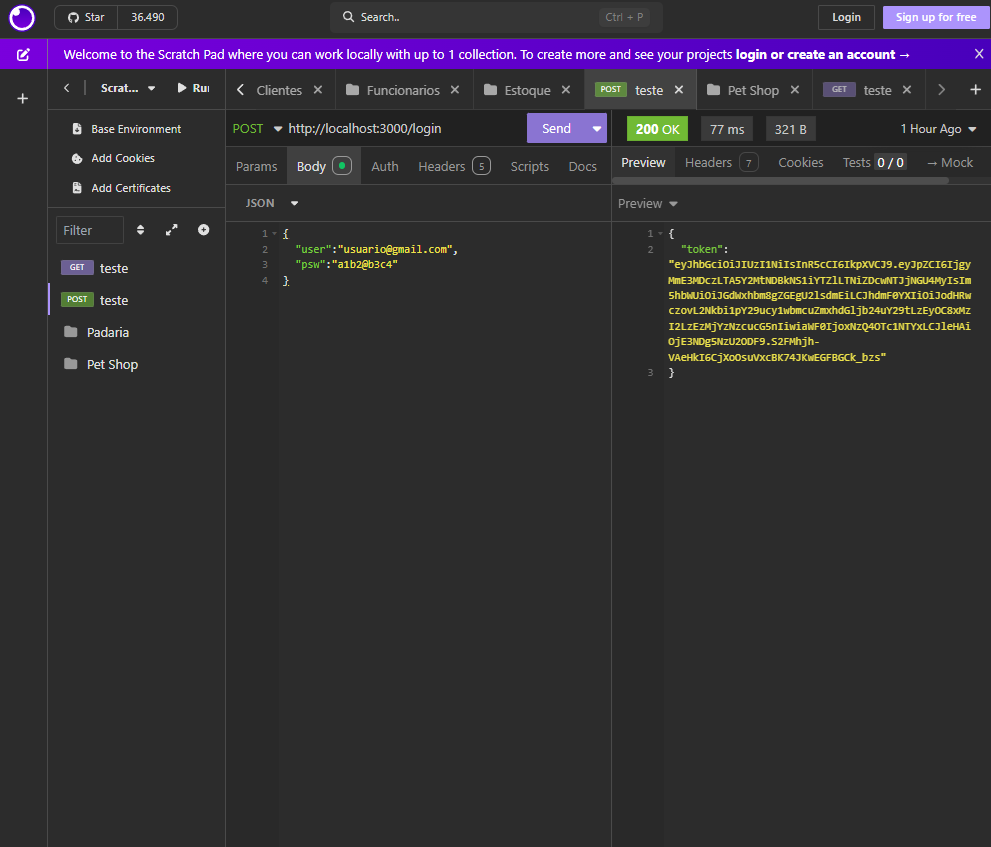
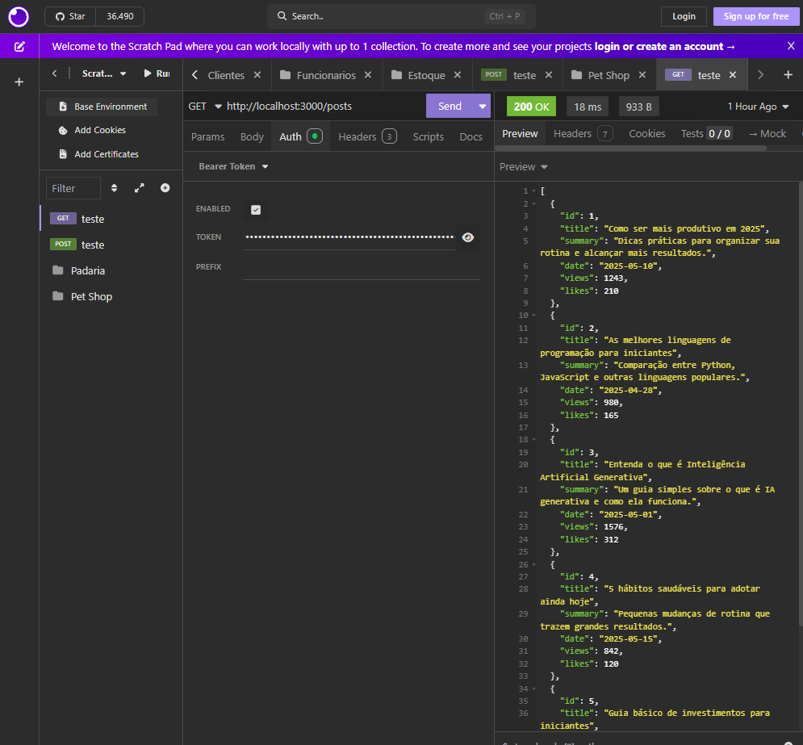

# Login - auth
Estrutura de autenticação para o projeto **Login**.
## Integrantes do grupo: [Steffany](https://github.com/steffanygiovanna), [Thamye](https://github.com/thamyeS) e [Rebeca](https://github.com/Rebecaalimaa)

## Para testar
- Clonar este repositório.
- Na pasta **./api**, criar um arquivo **.env **com as seguintes variáveis de ambiente:
```js
SECRET_JWT=f?#cPV9]2sc"}gQhO)Yx7IT1M*zuv&;FVC(vsFAz;]n2tK:T*uH|@Ixrow3bLC+
```
- Abrir com o VsCode e em um terminal cmd ou bash, executar o comando:
```bash
cd api
npm install
npx nodemon
```
## Tecnologias
- Node.js
- VsCode
- Insomnia
- Xampp

## Bibliotecas Utilizadas

- **/src** – Pasta principal com todo o código da API
  - **/controllers** – Arquivos responsáveis pela lógica das rotas
  - **/routes** – Arquivos que definem as rotas da API
  - **/middlewares** – Arquivos que fazem verificações (ex.: autenticação JWT)
  - **server.js** – Arquivo principal que sobe o servidor
- **express** – Framework para criar a API de forma simples e rápida
- **jsonwebtoken** – Usado para gerar e validar tokens JWT (autenticação)
- **cors** – Permite requisições de outros domínios (libera o acesso externo à API)
- **dotenv** – Carrega variáveis de ambiente do arquivo `.env`
- **nodemon** – Reinicia automaticamente o servidor quando há mudanças no código (desenvolvimento)

##  Rotas da API

###  POST `/login`
- Descrição: Realiza a autenticação do usuário.
- Retorna um token JWT.

###  GET `/posts`
- Descrição: Verifica o token JWT.
- Retorna todos os dados cadastrados.

## Funcionamento das Rotas

A API executa duas rotas principais:

### 1. Autenticação (`POST /login`)

*   **Controlador**: `src/controllers/login.js`
*   **Fluxo**: Recebe `user` (email) e `psw` (senha) no corpo da requisição. Valida as credenciais contra valores fixos no código (prática insegura para produção). Se as credenciais forem válidas, gera um JWT assinado com a `SECRET_JWT` (definida via `.env`) e com expiração de 2 minutos, contendo um ID de usuário aleatório, nome e avatar fixos. Retorna o token com status 200. Se inválidas, retorna 401.

### 2. Acesso aos Posts (`GET /posts`)

*   **Controlador**: `src/controllers/posts.js`
*   **Middleware**: `src/middlewares/auth.js`
*   **Fluxo**: Esta rota é protegida pelo middleware `validate`. O middleware extrai o token JWT do cabeçalho `Authorization`. Se o token estiver ausente, retorna 401. Se presente, verifica sua validade (assinatura e expiração) usando a `SECRET_JWT`. Se inválido, retorna 500 (idealmente seria 401/403). Se válido, anexa o payload do token à requisição e passa o controle ao controlador `posts`. O controlador lê dados de posts de `src/data/posts.js` e os retorna com status 200.

## Diagrama de Atividades UML

### Descrição do Diagrama

##  Prints do insomnia.

- Rota Post


- Rota Get


